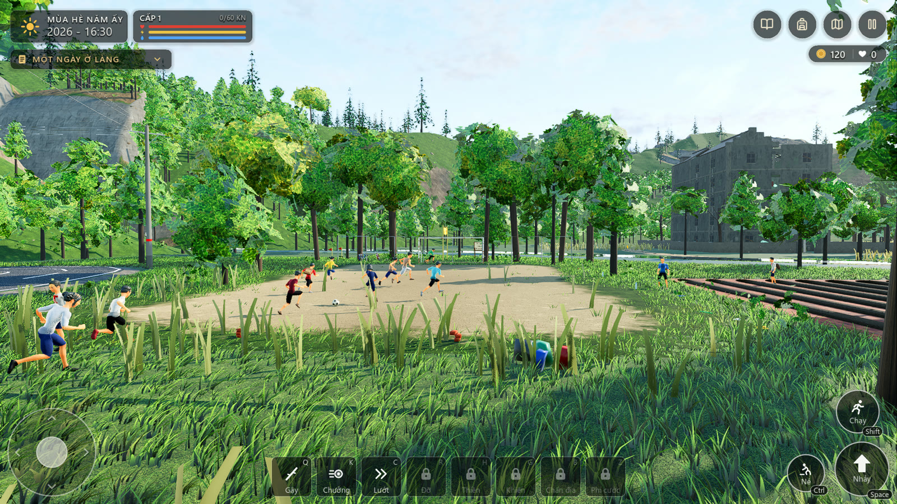
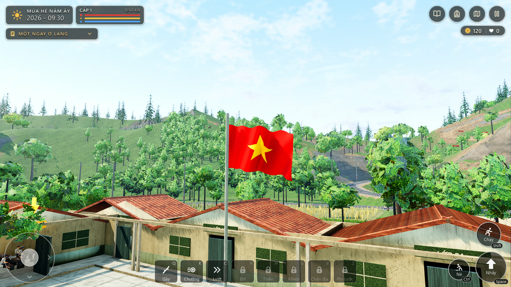
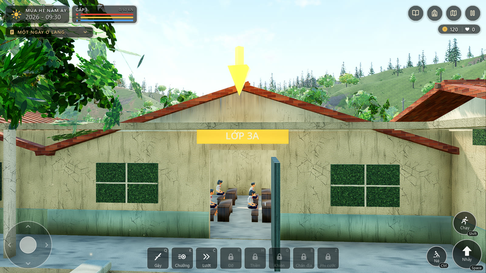
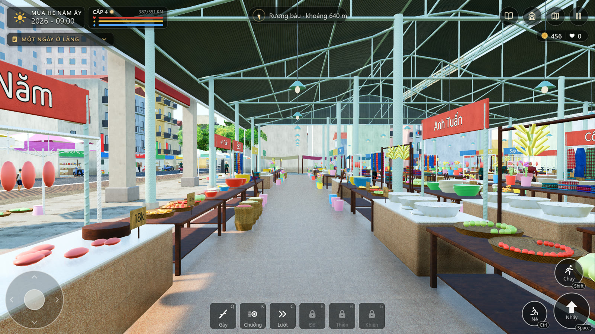
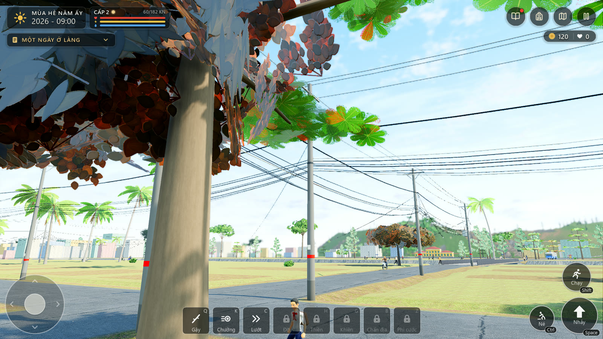
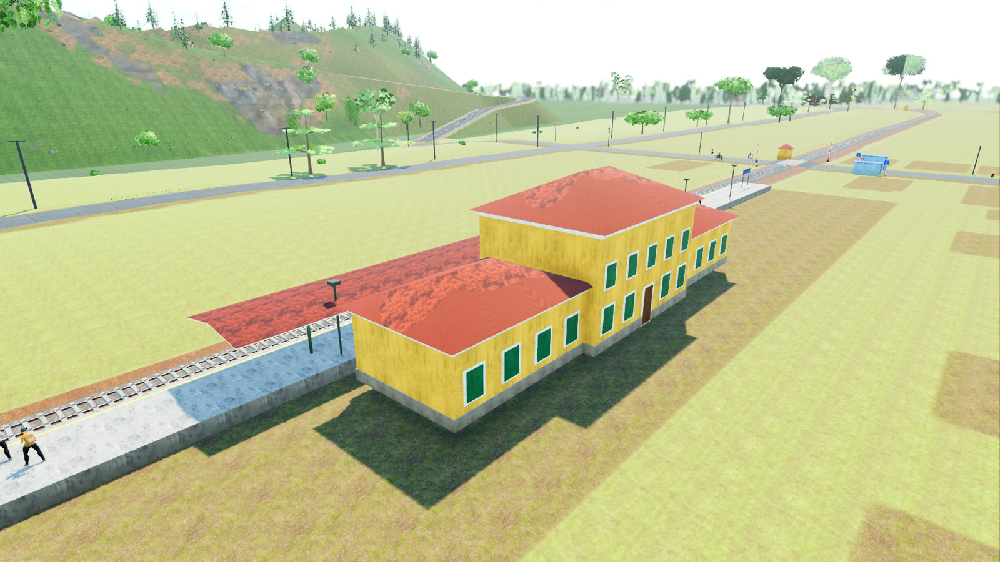
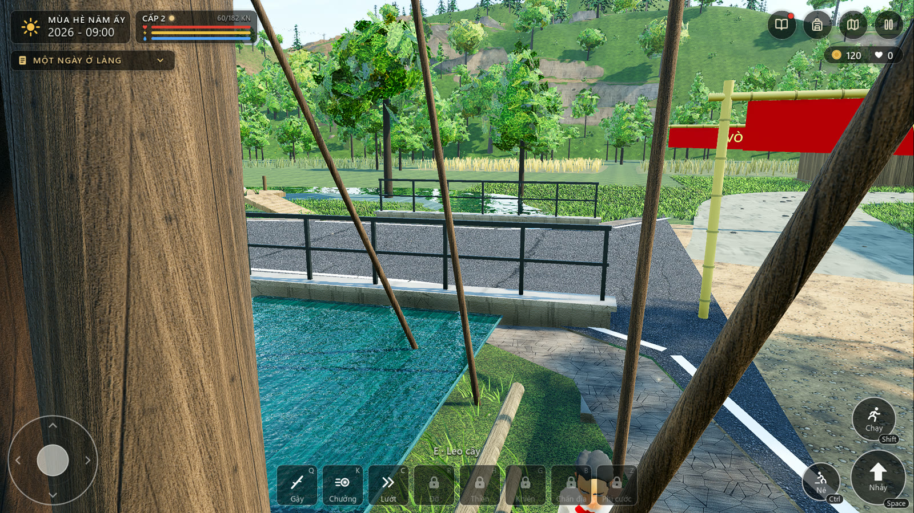
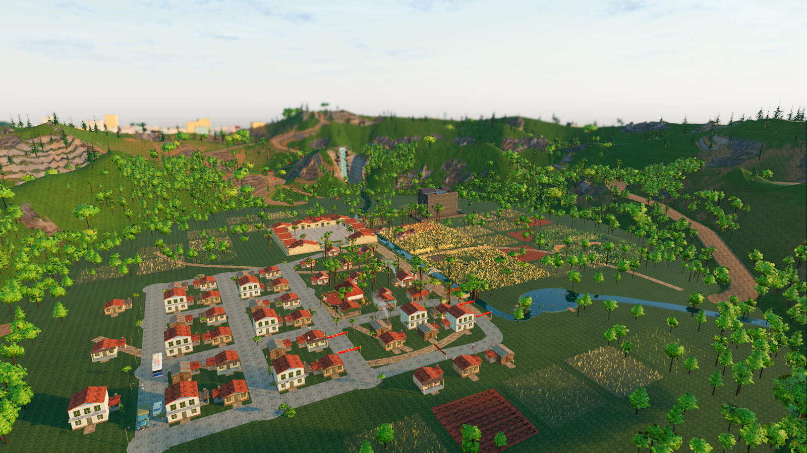

<div align="center">

# Mùa Hè Năm Ấy

**Một mùa hè ở làng quê Việt Nam, qua mắt một cậu học sinh: 3D, thế giới mở, làm bằng Godot 4.**

*A summer in a Vietnamese village, seen through a schoolboy's eyes: an open-world 3D game in Godot 4.*

[](https://godotengine.org)
[](https://docs.godotengine.org/en/stable/tutorials/scripting/gdscript/)
[](#kiểm-thử)
[](LICENSE)



</div>

---

## Giới thiệu

*Mùa Hè Năm Ấy* đưa bạn về một ngôi làng trong thung lũng, mùa hè, vào những năm đầu thập niên 90: mái ngói đỏ, đường đất, kênh nước, ruộng lúa chín vàng và tiếng ve. Bạn là một cậu học sinh tiểu học. Ngày của bạn có buổi học ở lớp 3A, những trò chơi của trẻ con, chợ làng, những chuyến xe buýt lên phố, và cả một vùng đất rộng lớn đang chờ được khám phá ngoài rìa làng.

Không có bản đồ dài dằng dặc hay nhiệm vụ ép buộc. Thế giới sống theo giờ của nó: trường vào lớp, chợ đông người, đường có xe, tàu chạy đúng giờ, chiều xuống thì lũ trẻ ra sân đá bóng.

> Tất cả nhân vật trong game là học sinh và người dân làng; trẻ em được thể hiện đúng là trẻ em (thân hình, đồng phục, khăn quàng đỏ).

## Ảnh chụp trong game

| | |
|:--:|:--:|
|  |  |
| *Lá cờ đỏ sao vàng bằng vải thật, bay theo gió* | *Lớp 3A: cửa mở, biển vàng, chỗ ngồi của em* |
|  |  |
| *Chợ Trung Tâm trong thành phố* | *Phố xá, cột điện, dây điện thoại chằng chịt* |
|  |  |
| *Ga tàu, sân ga và hành khách* | *Đường nhựa bắc qua kênh làng bằng cống hộp* |



**Video:** [Lũ trẻ đá bóng sau trường (42 giây, 1080p)](docs/videos/san-bong.mp4)

## Có gì trong game

### Làng và cuộc sống thường ngày
- **Ngôi làng thung lũng** dựng từ cảnh gốc: nhà ngói, ruộng lúa, ao, kênh, cầu đá vòm, cầu ván, cây ổi, tổ ong, chuồng gà.
- **Dân làng sống theo lịch**: nông dân ra đồng, học sinh đến trường, người bán hàng đứng quầy, các bác đi chợ; có thể chào hỏi, trò chuyện, tặng quà.
- **Trường tiểu học**: sân trường, 12 phòng học, cột cờ; vào **lớp 3A** học bài (hỏi đáp có thưởng), có cô giáo áo dài, có giờ vào lớp và giờ nghỉ.
- **Trò chơi dân gian**: nhảy dây, ô ăn quan, bắn bi, con quay, thả diều, bắt dế, chăn trâu, giúp bà nhặt rau, dựng nhà lá chuối...
- **Sân bóng đá của lũ trẻ** sau trường: đất nện, khung thành ống sắt cũ, lưới chùng, 12 đứa trẻ đá bóng thật (chuyền, sút, thủ môn bắt bóng, ăn mừng). Chạy vào quả bóng là sút được.
- **Mua bán**: tạp hóa, quán nước, nông sản; bán nông sản, mua hạt giống, trồng vườn nhà.
- **Nhà em**: ngủ, cất đồ, gặp mẹ, làm vườn.

### Thế giới mở
Một thế giới ngoài làng rộng khoảng **4 × 4 km**, nạp dần theo bước chân:
- **Cánh đồng lúa** phía tây, **thành phố** phía bắc (hơn 5.000 tòa nhà, 70 con phố, chợ trung tâm, phố buôn bán), **bãi biển** và **khu nghỉ dưỡng** phía đông và nam, cầu tàu, thuyền thúng, đồng cỏ, núi.
- **Núi non**: đèo, thác nước, đỉnh núi có cờ, **hang Dơi** với thạch nhũ và rương báu, sói hoang, thảo dược trên vách đá.
- **Phím F1 đến F7** nhảy nhanh tới từng vùng để xem.

### Xe buýt, xe ôm và tàu hỏa
- **4 tuyến xe buýt** nối làng với thành phố, hai bãi biển và cánh đồng lúa; bến, nhà chờ, xe dừng đón khách. Có thể **mua vé** hoặc gọi **xe ôm**.
- **Đường sắt dài gần 4 km** chạy vòng thung lũng: **5 ga**, **7 đường ngang** có rào chắn, chuông và đèn báo, **2 đoàn tàu** (đầu máy diesel và 4 toa) chạy suốt, có hành khách trên sân ga và trong toa. **Mua vé tàu** như xe buýt: lên tàu, đi, xuống ga.
- **Giao thông thật**: xe không đi xuyên nhau, dừng chờ nhau ở giao lộ, lùi lại nhường đường ở chỗ hẹp; ngã ba, ngã tư bo góc.

### Chiến đấu, kỹ năng và hiệu ứng
- Ma quái vào ban đêm, chó dữ, cua, rắn, móc túi; đám sói và **Sói đầu đàn** trên núi.
- Vũ khí và dụng cụ: gậy tầm vông, kiếm gỗ, ná cao su, cưa, cung tên, cần câu...
- Kỹ năng: chưởng, đỡ đòn, phi cước, chấn địa, khiên, thiền, bay, lặn; hiệu ứng hạt, bụi, sóng.

### Đua xe đạp, leo núi, câu cá, bắn cung
- Ba cuộc đua có huy chương: **Vòng quanh làng**, **Đổ đèo**, **Leo đỉnh**.
- Câu cá, bắn cung, tìm kho báu qua ba chiếc rương.

### Hình ảnh và môi trường
- Ánh sáng theo giờ thật: bình minh, nắng gắt, chiều hoài niệm, đêm trăng, đèn đường và cửa sổ bật lên.
- **Gió** thay đổi theo giờ và theo từng cơn: cờ bay, tán cây lắc.
- Shader riêng cho địa hình (nhiều lớp vật liệu, cỏ, sỏi), nước, đại dương, vải, da người, lá cây; FSR2 để hình ảnh nét.
- **Hệ thống điện**: cột điện, đường dây, máy biến áp, dây dẫn vào từng nhà.
- Hơn **100 âm thanh** môi trường và hiệu ứng, tiếng ve, tiếng gà, chuông trường, còi tàu.

## Điều khiển

| Phím | Hành động | Phím | Hành động |
|:--|:--|:--|:--|
| `W A S D` / mũi tên | Di chuyển | `Q` | Tấn công |
| `Shift` | Chạy | `E` | Tương tác, mua vé, nói chuyện |
| `Space` | Nhảy | `F` | Nhặt, bật đèn pin |
| `Ctrl` | Né | `1` `2` | Đổi dụng cụ |
| `Tab` | Xem toàn cảnh | `X` | Cất dụng cụ |
| `N` | Ngày / đêm | `T` | Tặng quà |
| `V` `C` | Bay / lặn | `K` `R` `H` `G` `B` `Z` | Chưởng, đỡ, thiền, khiên, chấn địa, phi cước |
| `F1` – `F7` | Nhảy tới từng vùng | | |

Giao diện cảm ứng (cần điều khiển ảo) cũng được hỗ trợ.

## Chạy game

**Yêu cầu:** [Godot 4.7.2](https://godotengine.org/download/archive/4.7.2-stable/) và card đồ họa hỗ trợ Vulkan. Dự án nặng hình ảnh; khuyên dùng GPU rời.

```bash
git clone https://github.com/1bilstar/mua-he-nam-ay.git
cd mua-he-nam-ay
godot --path . 
```

Hoặc mở thư mục bằng Godot Editor rồi bấm chạy (`Main.tscn`). Lần đầu Godot sẽ nhập lại tài nguyên nên mất vài phút.

Chất lượng đồ họa đổi trong menu Cài đặt (Thấp, Trung bình, Cao, Siêu thực).

## Kiểm thử

```bash
# kiểm tra cú pháp toàn bộ script (nhanh)
godot --headless --path . --script res://tools/ParseCheck.gd

# 316 bài kiểm thử đơn vị (giao thông, kinh tế, trường học, kỹ năng, ...)
godot --headless --path . --script res://tests/run_tests.gd

# bài kiểm thử tích hợp: chơi game thật, ~25 phút, cần cửa sổ đồ họa
godot --position -4000,-4000 --path . --script res://VerifyGame.gd -- --fresh
```

Các công cụ chụp ảnh và quay phim trong `tools/` (`CaptureWorld`, `CaptureCity`, `CaptureTraffic`, `CaptureField`, `FieldMovie`, `Trailer` ...) chạy có cửa sổ và ghi ra thư mục `artifacts/` (không đưa lên Git).

## Cấu trúc dự án

```
Main.tscn              cảnh chính
SceneRebuilder.gd      dựng cảnh, vòng lặp game
Realism*.gd            lớp hình ảnh: vật liệu, ánh sáng, đám đông, cỏ, khói, thác nước
GameHUD.gd             giao diện
game/
  life/                đời sống trong làng: trường, chợ, nhà, sân bóng, giao thông làng, đua xe...
  world/               thế giới mở: thành phố, biển, xe buýt, tàu hỏa, điện, gió, cờ
  mountain/            núi, hang, thảo dược, sói, đỉnh núi
  ...                  chiến đấu, kỹ năng, vũ khí, hiệu ứng, kẻ địch
shaders/               shader địa hình, nước, vải, cờ, lá...
assets/                mô hình, kết cấu, âm thanh, dữ liệu thế giới đã bake
tools/                 bake thế giới (Python), chụp ảnh, quay phim, kiểm tra
tests/                 kiểm thử đơn vị
docs/screenshots/      ảnh dùng trong README
```

Thế giới ngoài làng được sinh bằng các script Python trong `tools/` (`gen_world.py`, `gen_mountains.py`, `gen_transit.py`); tuyến đường, đường sắt và ga được bake sẵn vào `assets/world/`. Xem `CLAUDE.md` để biết lệnh chi tiết và các quy ước.

## Giấy phép và ghi công

- **Mã nguồn** của dự án theo giấy phép [MIT](LICENSE).
- **Tài nguyên bên thứ ba** giữ giấy phép gốc:
  - Nhân vật, hoạt ảnh, động vật, tóc: [Quaternius](https://quaternius.com), CC0 (`assets/thirdparty/quaternius`).
  - Kết cấu và đá: [Poly Haven](https://polyhaven.com) và [ambientCG](https://ambientcg.com), CC0 (`assets/thirdparty/CREDITS_world.md`).
  - Biểu tượng: [Lucide](https://lucide.dev), ISC. Phông chữ: Baloo 2, SIL OFL (`ui/LICENSES.md`).
  - Âm thanh môi trường và hiệu ứng: tạo bằng ElevenLabs (`assets/audio/audio_credits.md`).

---

<details>
<summary><b>English summary</b></summary>

**Mùa Hè Năm Ấy** ("That Summer") is an open-world 3D game set in a Vietnamese mountain-valley village in the early 1990s, built with **Godot 4.7** and GDScript. You play a primary-school pupil: attend class, play village games, shop at the market, ride buses and trains, race bicycles, explore a streamed 4×4 km world (paddies, a city of 5,000+ buildings, beaches, mountains and a cave), fight night ghosts and wolves, or join the village kids' pickup football game.

Highlights: a living village on daily schedules, a full transit system (four bus routes, xe ôm, and a 4 km railway loop with five stations, level crossings and two passenger trains), traffic that yields and reverses on narrow roads, cloth flags and trees moving with a live wind, an electrical network of poles and wires, and a large custom shader layer (terrain, water, fabric, skin).

To run it, open the folder with Godot 4.7.2 (`godot --path .`). Unit tests: `godot --headless --path . --script res://tests/run_tests.gd`. Code is MIT; bundled third-party assets (Quaternius, Poly Haven, ambientCG: CC0; Lucide: ISC; Baloo 2: OFL) keep their own licences.

</details>
